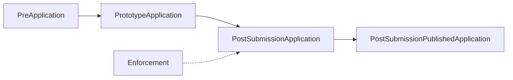

## Overview

The Digital Planning Data Schemas system includes several schema types that represent different stages and contexts of the planning application process. Each schema type is optimized for its specific use case.

## Schema Types

### Application

The general-purpose schema for planning applications generated by digital planning services.

```typescript /types/schemas/application/index.ts
export interface Application {
  data: {
    application: ApplicationData;
    user: User;
    applicant: Applicant;
    property: Property;
    proposal: Proposal;
    files?: FilesAsData;
  };
  preAssessment?: PreAssessment;
  responses: Responses;
  files: File[];
  metadata: Metadata;
}
```

<Accordion title="Key Features">
  - General-purpose structure for any planning application
  - Includes pre-assessment results when applicable
  - Flexible file handling with both embedded file data and file references
  - Metadata from any digital planning service provider
</Accordion>

**When to use**: For general planning applications across various digital planning services.

---

### PrototypeApplication

The prototype schema for planning applications in England, designed for applications generated before submission (e.g., via PlanX).

```typescript /types/schemas/prototypeApplication/index.ts
interface Application<T extends ApplicationType> {
  applicationType: T;
  data: {
    user: UserBase;
    applicant: Applicant<T>;
    application: ApplicationData<T>;
    property: Property<T>;
    proposal: Proposal<T>;
  };
  responses: Responses;
  files: File[];
  metadata: PrototypePlanXMetadata;
}

export type PrototypeApplication =
  | LawfulDevelopmentCertificateExisting
  | LawfulDevelopmentCertificateProposed
  | PriorApprovalPart1ClassA
  | PriorApprovalPart3ClassQ
  | PlanningPermissionFullHouseholder
  | PlanningPermissionFullMinor
  | PlanningPermissionFullMajor
  | WorksToTreesConsent
  | WorksToTreesNotice
  | ListedBuildingConsent
  | HedgerowRemovalNotice
  // ... and many more types
```

<Accordion title="Supported Application Types">
  The PrototypeApplication schema supports over 80 specific application types:
  
  **Lawful Development Certificates**
  - Existing use (`ldc.existing`)
  - Proposed use (`ldc.proposed`)
  - Breach of condition (`ldc.breachOfCondition`)
  - Listed building works (`ldc.listedBuildingWorks`)
  
  **Prior Approvals** (Parts 1-20)
  - Part 1, Class A: Extensions to dwellings (`pa.part1.classA`)
  - Part 3, Class Q: Agricultural buildings to dwellings (`pa.part3.classQ`)
  - Part 6, Class A: Agricultural buildings (`pa.part6.classA`)
  - Part 20, Class A: Demolition of buildings (`pa.part20.classA`)
  
  **Planning Permission**
  - Full Householder (`pp.full.householder`)
  - Full Minor (`pp.full.minor`)
  - Full Major (`pp.full.major`)
  - Outline applications (`pp.outline.*`)
  
  **Other Types**
  - Works to trees consent/notice (`wtt.consent`, `wtt.notice`)
  - Listed building consent (`listed`)
  - Hedgerow removal notice (`hedgerowRemovalNotice`)
  - And more...
</Accordion>

<Accordion title="Type-Specific Structures">
  The schema uses TypeScript generics to provide type-specific variations:
  
  ```typescript
  // Different application types have different data requirements
  type ApplicationData<T extends ApplicationType> =
    T extends keyof ApplicationDataVariants
      ? ApplicationDataVariants[T]
      : ApplicationDataBase;
  
  interface ApplicationDataVariants {
    'ldc.existing': FeeCarryingApplicationData;
    'pp.full.householder': PPApplicationData;
    'wtt.consent': NonFeeCarryingApplicationData;
    // ...
  }
  ```
</Accordion>

**When to use**: For applications being designed and submitted through digital planning services like PlanX, before they enter a back-office system.

**Example**: A householder planning application

```json /examples/prototypeApplication/planningPermission/fullHouseholder.json
{
  "applicationType": "pp.full.householder",
  "data": {
    "application": {
      "fee": {
        "calculated": 258,
        "payable": 258,
        "category": {
          "sixAndSeven": 258
        }
      },
      "declaration": {
        "accurate": true,
        "connection": {
          "value": "none"
        }
      }
    },
    "user": {
      "role": "proxy"
    },
    "applicant": {
      "type": "individual",
      "name": {
        "first": "David",
        "last": "Bowie"
      },
      "email": "ziggy@example.com",
      "ownership": {
        "interest": "owner.sole",
        "certificate": "a"
      }
    },
    "property": {
      "address": {
        "uprn": "100021892955",
        "singleLine": "40, STANSFIELD ROAD, LONDON, SW9 9RZ"
      },
      "boundary": {
        "site": {
          "type": "Feature",
          "geometry": {...}
        }
      },
      "type": "residential.dwelling.house.detached"
    },
    "proposal": {
      "projectType": ["extend.rear"],
      "description": "Construction of a single-storey rear extension"
    }
  },
  "responses": [...],
  "files": [...],
  "metadata": {...}
}
```

---

### PreApplication

The schema for pre-application advice requests.

```typescript /types/schemas/preApplication/index.ts
export interface PreApplication {
  data: {
    application: PreApplicationData;
    user: User;
    applicant: PreApplicant;
    property: Property;
    proposal: Proposal;
  };
  responses: Responses;
  files: File[];
  metadata: PlanXMetadata;
}
```

**When to use**: For pre-application advice requests where applicants seek guidance before submitting a formal application.

**Key differences from full applications**:
- Simplified applicant data requirements
- No fee calculation (advice may have separate fee structure)
- Focus on proposal description and initial assessment

---

### PostSubmissionApplication

The schema for planning applications after they've been submitted to and are being processed by a back-office planning system.

```typescript /types/schemas/postSubmissionApplication/index.ts
export interface ApplicationSpecification<T extends ApplicationType> {
  applicationType: T;
  data: {
    application: Application<T>;
    localPlanningAuthority: LocalPlanningAuthority<T>;
    submission: Submission<T>;
    validation?: Validation<T>;
    consultation?: Consultation<T>;
    assessment?: Assessment<T>;
    appeal?: Appeal<T>;
    caseOfficer: CaseOfficer<T>;
  };
  comments?: {
    public?: PublicComments;
    specialist?: SpecialistComments;
  };
  files?: PostSubmissionFile[];
  submission: PrototypeApplication; // Original submission
  metadata: PostSubmissionMetadata;
}

export type PostSubmissionApplication =
  | PostSubmissionLawfulDevelopmentCertificateExisting
  | PostSubmissionPriorApprovalPart1ClassA
  | PostSubmissionPlanningPermissionFullHouseholder
  // ... all application types
```

<Accordion title="Post-Submission Data Model">
  The post-submission schema includes additional data that accumulates during processing:
  
  **Validation Stage**
  ```typescript
  interface Validation {
    receivedAt: DateTime;
    validatedAt?: DateTime;
    validationRequests?: ValidationRequest[];
  }
  ```
  
  **Consultation Stage**
  ```typescript
  interface Consultation {
    startDate: Date;
    endDate: Date;
    publicNotice?: PublicNotice;
    siteNotice?: SiteNotice;
    neighbourLetters?: NeighbourLetters;
  }
  ```
  
  **Assessment Stage**
  ```typescript
  interface Assessment {
    decision?: AssessmentDecision;
    planningOfficerDecisionDate?: Date;
    committeeDecisionDate?: Date;
    conditions?: Condition[];
  }
  ```
  
  **Appeal Stage**
  ```typescript
  interface Appeal {
    lodgedDate?: Date;
    validatedDate?: Date;
    startedDate?: Date;
    decisionDate?: Date;
    decision?: AppealDecision;
  }
  ```
</Accordion>

<Accordion title="Comments System">
  The schema includes structured support for public and specialist comments:
  
  ```typescript
  interface PublicComment {
    submittedAt: DateTime;
    publishedAt?: DateTime;
    sentiment?: 'objection' | 'support' | 'neutral';
    topicAndComments: Array<{
      topic: PublicCommentTopic;
      comments: string;
    }>;
  }
  
  interface SpecialistComment {
    specialist: {
      id: number;
      name: string;
      organisation: string;
    };
    comments: Array<{
      submittedAt: DateTime;
      comment: string;
      sentiment?: SpecialistCommentSentiment;
    }>;
  }
  ```
</Accordion>

**When to use**: For applications that have entered a back-office planning system and are progressing through validation, consultation, assessment, and potentially appeal stages.

**Key additions**:
- Complete audit trail with process stages
- Local planning authority assignment
- Case officer details
- Public and specialist consultation comments
- Assessment decisions and conditions
- Appeal information
- Enhanced file metadata with associations

---

### PostSubmissionPublishedApplication

A variant of PostSubmissionApplication intended for public-facing APIs, with potentially redacted sensitive information.

```typescript /types/schemas/postSubmissionPublishedApplication/index.ts
export type PostSubmissionPublishedApplication = PostSubmissionApplication;
```

<Note>
  Currently shares the same structure as PostSubmissionApplication. Future versions may include redactions for data protection.
</Note>

**When to use**: For public-facing planning registers and APIs where applications must be accessible to the public.

---

### Enforcement

The schema for planning enforcement breach reports.

```typescript /types/schemas/enforcement/index.ts
export interface Enforcement {
  data: {
    application: {
      type: {
        value: 'breach';
        description: 'Report a planning breach';
      };
    };
    complainant: Complainant;
    property: Site & {type: PropertyType};
    report: {
      boundary?: GeoBoundary;
      date?: {
        start: Date;
        end?: Date;
      };
      description?: string;
      projectType?: (BreachType | {value: string; description?: string})[];
    };
  };
  responses: Responses;
  files?: File[];
  metadata: PlanXMetadata;
}
```

<Accordion title="Breach Types">
  The enforcement schema supports various breach categories:
  - Unauthorized building work
  - Change of use without permission
  - Breach of planning conditions
  - Works to protected trees
  - Listed building violations
  - Advertisement violations
  - And more...
</Accordion>

**When to use**: For reporting suspected planning breaches or violations.

**Key features**:
- Complainant information (may be anonymous)
- Temporal tracking (when did the breach start/end)
- Spatial boundary of the breach
- Categorization by breach type
- Supporting evidence files

---

## Type Relationships

<Steps>
  <Step title="PreApplication">
    Initial advice-seeking stage
  </Step>
  
  <Step title="PrototypeApplication">
    Full application designed and prepared for submission
  </Step>
  
  <Step title="PostSubmissionApplication">
    Application received and being processed by the local planning authority
  </Step>
  
  <Step title="PostSubmissionPublishedApplication">
    Processed application published for public access
  </Step>
</Steps>



## Common Patterns

### Generic Type Parameters

Many schemas use TypeScript generics to provide type-specific variations:

```typescript
interface Application<T extends ApplicationType> {
  applicationType: T;
  data: {
    applicant: Applicant<T>;
    property: Property<T>;
    proposal: Proposal<T>;
  };
}

// Type-specific variations
type Property<T extends ApplicationType> =
  T extends keyof PropertyVariants
    ? PropertyVariants[T]
    : BaseProperty;
```

### Shared Components

All schemas reuse common components:

- **Responses**: Question/answer pairs
- **Files**: File upload metadata
- **Metadata**: Submission and service metadata
- **User**: User roles and data
- **Addresses**: UK address structures
- **Boundaries**: GeoJSON spatial data

## Choosing the Right Schema

<CardGroup cols={2}>
  <Card title="Building a Planning Service?" icon="hammer">
    Use **PrototypeApplication** to structure data as users complete your digital planning service.
  </Card>
  
  <Card title="Building a Back Office System?" icon="building">
    Use **PostSubmissionApplication** to manage applications through validation, consultation, and assessment.
  </Card>
  
  <Card title="Building a Public Register?" icon="globe">
    Use **PostSubmissionPublishedApplication** for public-facing APIs.
  </Card>
  
  <Card title="Accepting Enforcement Reports?" icon="shield">
    Use **Enforcement** for breach reporting services.
  </Card>
</CardGroup>

## Next Steps

<Card title="Validation" href="/concepts/validation" icon="check">
  Learn how to validate data against these schemas
</Card>